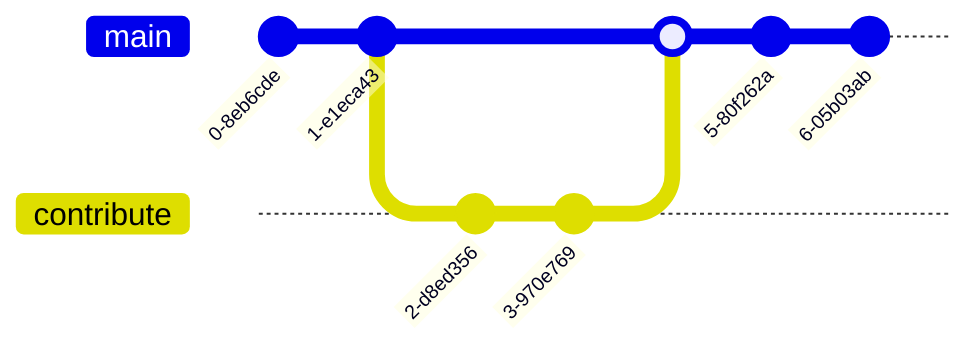

# Architecture Process
So how are we going to get this done?

Well, definitely open to suggestions :) 

For now, we will follow the basic course of standard UML diagram notation, with the static and dynamic approaches.  Therefore, we continue to evolve our use case diagrams, class diagrams, state diagrams, sequence diagrams etc.

As this is a collaborative effort, we will start high level.  Please feel free to contribute as either the constructor of something to investigate (use case for example) or dive into a solution like a state diagram

# Working Collaboratively
In the open source world, we accomplish this through suggesting changes.  Therefore, to propose a change, follow these steps (its easy)
1. Clone this repo - get it local
2. Create a branch - your version of the code
3. Commit your branch (with your changes)
4. Submit a Pull Request to the moderators
5. Have discussion with team (in many cases there is no need)
6. Moderators will merge your changes in main branch
7. Congratulations- well done, you have contributed to Open Source & the web3 InsurTech Foundation
8. Repeat

Or, shown in a mermaid flow diagram



# Tools
There are many tools to promote architecture, however, to keep it simple.  This makes it easiest, at least for now, to collaborate.  
## Git markdown
Git markdown is the "secret" language behind this page, nothing special really, just notepad, and best done in VS Code.  If you need help with VS Code, just reach out

## Mermaid
This is a fantastic addition to the Git markdown world.  It can create many diagrams very simply, you will find more details on their site (https://mermaid.live/) and in addition, a live editor that lets you see your diagrams in real time.

All you have to do then is copy and paste the "code" from mermaid (and its just a few lines) and paste it directly into your markdown page.

Please note, you will need to surround your mermaid markdown text with the following

 ~~~
 ```mermaid
 {your mermaid code here}
 ```
 ~~~

 please note the 3 backticks to start the macro process in markdown.  Don't worry, just hit the preview

 ## Visual Paradigm
 Many of us have used this tool for many years, and in time to time, we will post some of these files into the repo, as there is a lot of information that can be easily generated.  You can download the community edition for free, or the paid starter edition is very cost effective, you will save a lot of time with it.

 # Final Thoughts
 If you have other tools or process suggestion, pease send a note, or update this page
 