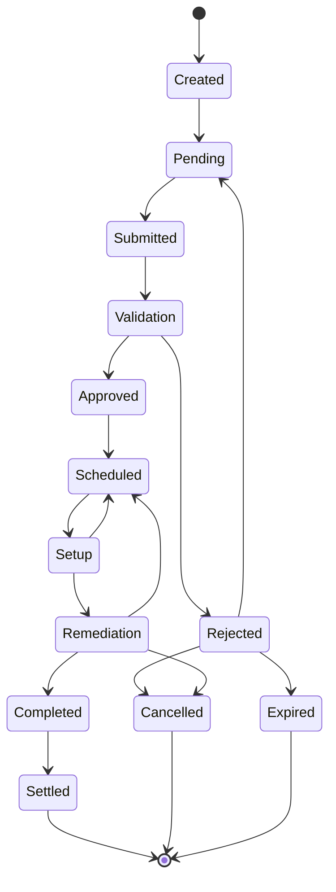

# Claim State
Claim state diagram, for the general insurance claim case, we detail out the process of a claim submission and execution.

Clearly there are many sub steps to this process

As we explore the relationships between different Insurance Domains as they pertain to Claims (ie, and auto claim versus home property claim), there are nuances around legal requirements, risk evaluation, quality of work etc.