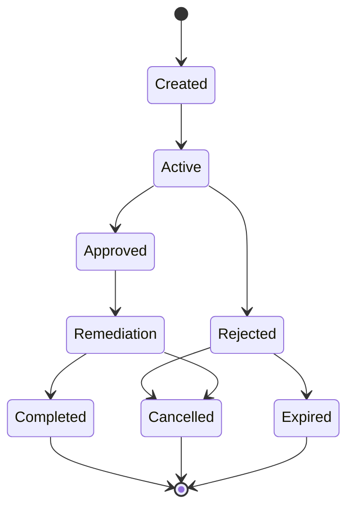

# Claim Domain

The Claim Domain helps resolve the challenges when the eventuality strikes.  Its how the insured get "made whole" and the insurer reduce their severity.  This domain drives to the very core of the industry, it is where the trust is lost and earned.

This is truly the greatest single opportunity for the web3 space, and one that will have great attention in this project.

Simply put, the high level claim state looks like this

Now, as we dive deeper, and you will find we have started in the claim-states document, to tease out the sub states.