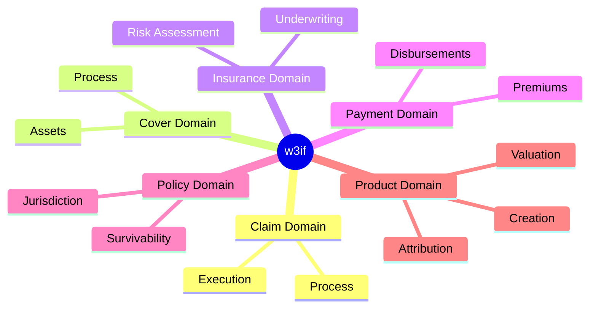

# Insurnace Domains

This is the base collection of architecture artifacts as they relate to the 6 core subject domains

1. Claim Domain
2. Cover Domain
3. Insurance Domain
4. Payment Domain
5. Policy Domain
6. Product Domain

There are a few supplemental domains, cross cutting, such as 
1. Security Domain
2. Governance Domain

You will find a separate folder for each of these domains, as we go deep into the solution architecture

Refresh for 11/23